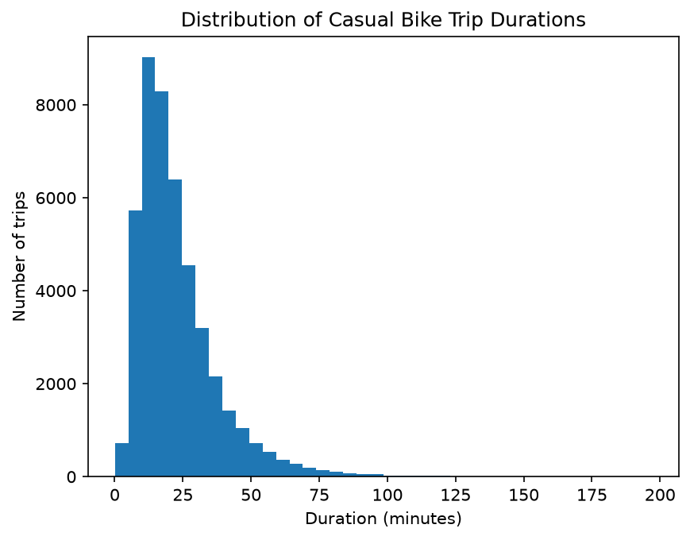

### README: Log of ridership and stations for Ride Knox in 2025

## Data
`trips_2025.csv` — one row per trip:
| column | type | notes |
| ------------------------------- | -------- | ---------------------------------- |
| trip_id | str | unique, T-series |
| start_time / end_time | datetime | stored as text in the raw file |
| start_station_id | str | joins to stations.station_id |
| start_station_name | str | authoritative names in stations.xlsx |
| end_station_id | str | ~3,800 missing (kept and flagged) |
| rider_type | str | member / casual (raw has 6 spellings) |
| bike_type | str | classic / electric |`

`stations.xlsx` — one row per station:
| column | type | notes |
| ------------------------------- | -------- | ---------------------------------- |
| station_id | str | station ID |
| station_name | str | name of station |
| neighborhood | str | neighborhood of station |
| latitude | float64 | latitude of location |
| longitude | float64 | longitude of location |
| docks | int64 | number of docks at station |
| year_installed | int64 | year station was installed |`
Raw files are not in the repo. Contact Ride Knox to obtain them.
## How to run
Install Anaconda and Jupyter Notebook
Open analysis.ipynb
Restart & Run All
## Key findings
The implementation of the day pass and creation of new stations have improved ridership from and decreased bottlenecking of stations in 2025.

## Limitations
This evidence is observational: there was also a steep drop-off in July 2025 that has not proven to not be seasonality because the 2026 data is only through June. Additionally, there are only four months of data for the day pass: we cannot be certain that the newness of it is not inflating ridership.
## Repo structure
ride-knox-analysis
|--- README.md
|--- report.md
|--- WORKLOG.md
|--- analysis.ipynb
|--- .gitignore