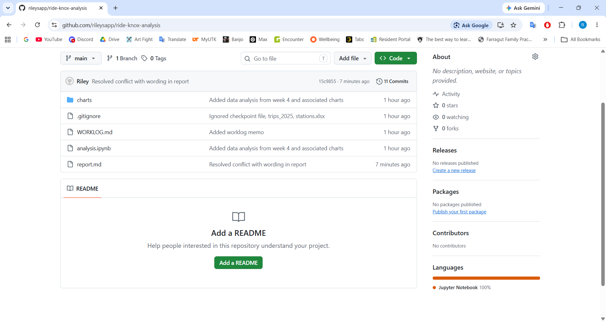

# DATA 501: M5_Assignment
# Name: Riley Sapp
# Net ID: rsapp4
## Part 0
```
git version 2.55.0.windows.5
Riley
rsapp4@utk.edu
Q0: Git needs your name and email before your first commit because it notes who is making the changes on the code.
```
## Part 1
```
1b: On branch master

No commits yet

Untracked files:
  (use "git add <file>..." to include in what will be committed)
        WORKLOG.md
        analysis.ipynb
        charts/
        report.md

nothing added to commit but untracked files present (use "git add" to track)

1c: [master (root-commit) 65a1b1b] Added report memo from week 4
 1 file changed, 6 insertions(+)
 create mode 100644 report.md

1d:[master da40b1d] Added data analysis from week 4 and associated charts
 3 files changed, 750 insertions(+)
 create mode 100644 analysis.ipynb
 create mode 100644 charts/distribution_of_casual_bike_trip_durations.png
 create mode 100644 charts/distribution_of_day_pass_bike_trip_durations.png

1e: On branch master
nothing to commit, working tree clean

Q1. If you were to need to undo one of the changes in the future, then it would be beneficial for them to be in separate commits. For example, if I did not mean to add analysis.ipynb or charts/ to my repository, I can then go back to where I made that mistake.
```

## Part 2
```
2c. On branch master
Changes not staged for commit:
  (use "git add <file>..." to update what will be committed)
  (use "git restore <file>..." to discard changes in working directory)
        modified:   WORKLOG.md

no changes added to commit (use "git add" and/or "git commit -a")

Q2. The raw CSV should stay untouched forever.
```

## Part 3
```
3b. diff --git a/report.md b/report.md
index 9bfe4fd..5a31343 100644
--- a/report.md
+++ b/report.md
@@ -2,5 +2,5 @@ PART E: MEMO
 The implementation of the day pass and creation of new stations have improved ridership from and decreased bottlenecking of stations in 2025.
 Casual riders took an average of 1,935 fewer trips per month in 2026 compared to the same period in 2025. However, non-member riders (casual and day pass riders combined), took an average of 490 more rides per month compared to the same period in 2025 (see chart:"Member vs. Casual vs. Day Pass Trips Per Month in 2026"). Additionally, the Student Union and Hodges stations are relatively significantly less pressured than they previously were (Hodges is now the tenth most-pressured station, down from being the fourth, and the Student Union is no longer within the top ten, down from being the fifth). The new station S25, Cumberland Ave & 22nd St, is within the top 
warning: in the working copy of 'report.md', LF will be replaced by
 CRLF the next time Git touches it
diff --git a/report.md b/report.md
index 9bfe4fd..5a31343 100644
--- a/report.md
+++ b/report.md
@@ -2,5 +2,5 @@ PART E: MEMO
 The implementation of the day pass and creation of new stations ha
ve improved ridership from and decreased bottlenecking of stations 
in 2025.
warning: in the working copy of 'report.md', LF will be replaced by CRLF the next time Git touches it
diff --git a/report.md b/report.md
index 9bfe4fd..5a31343 100644
--- a/report.md
+++ b/report.md
@@ -2,5 +2,5 @@ PART E: MEMO
 The implementation of the day pass and creation of new stations have improved ridership from and decreased bottlenecking of stations in 2025.
 Casual riders took an average of 1,935 fewer trips per month in 2026 compared to the same period in 2025. However, non-member riders (casual and day pass riders combined), took an average of 490 more rides per month compared to the same period in 2025 (see chart:"Member vs. Casual vs. Day Pass Trips Per Month in 2026"). Additionally, the Student Union and Hodges stations are relatively significantly less pressured than they previously were (Hodges is now the tenth most-pressured station, down from being the fourth, 
and the Student Union is no longer within the top ten, down from being the fifth). The new station S25, Cumberland Ave & 22nd St, is within the top ten most pressured station
s.
 The day pass riders exhibited similar behavior as casual riders in their duration of their trips, indicating that these riders were the same consumer type as casual riders, 
which suggests that these riders would not otherwise be members. It can be assumed that the dock expansion has relieved pressure in the stations and that the implementation o
f the new station has encouraged riders that would otherwise attend more pressured stations to attend it instead, decreasing pressure. This is our interpretation, not a prove
n cause.
-This evidence is observational. There was also a steep drop-off in July 2025 that has not proven to not be seasonality because the 2026 data is only through June. Additional
ly, there are only four months of data for the day pass: we cannot be certain that the newness of it is not inflating ridership.
+Limitations: This evidence is observational: there was also a steep drop-off in July 2025 that has not proven to not be seasonality because the 2026 data is only through Jun
e. Additionally, there are only four months of data for the day pass: we cannot be certain that the newness of it is not inflating ridership.
 Recommendations: Continue the day pass promotion through the end of the year to compare ridership data to 2025.
\ No newline at end of file
(END)

3c: 9464404 (HEAD -> master) Reworded line about minimum trip duration in report.md
5e293d5 Ignored checkpoint file, trips_2025, stations.xlsx
0711cc6 Added worklog memo
da40b1d Added data analysis from week 4 and associated charts
65a1b1b Added report memo from week 4

Q3: Git diff would not have shown the change made in class.
```

## Part 4
```
4a: git restore --staged report.md
On branch master
Changes not staged for commit:
  (use "git add <file>..." to update what will be committed)
  (use "git restore <file>..." to discard changes in working directory)
        modified:   WORKLOG.md

no changes added to commit (use "git add" and/or "git commit -a")

4b On branch master
Changes not staged for commit:
  (use "git add <file>..." to update what will be committed)
  (use "git restore <file>..." to discard changes in working directory)
        modified:   WORKLOG.md

no changes added to commit (use "git add" and/or "git commit -a")

4c: Revert "Added exaggerated claim on purpose for Part 4"
 1 file changed, 1 deletion(-)

 Q4: 4c left two extra commits because each one served a different purpose and should be able to be traced with a note.
 ```

 ## Part 5
 ```
 5a: master
* min-cutoff-2min
Q5a: One commit is the right call here because both edits were for the same action (changing value from 1 to do).

5c: While on the main branch, report.md does not exhibit the changes made to the 2min-cutoff branch.

5d: Updating de6acdb..4d129ac
Fast-forward
 report.md | 2 +-
 1 file changed, 1 insertion(+), 1 deletion(-)

 Q5b: Fast-forward shows that the main hasn't moved since branching; Git instead just slides the label forward.

 5e:* main
```
 ## Part 6
```
6a: [reword-limitations db9f963] Added false sentences for Part 6
 1 file changed, 1 insertion(+), 1 deletion(-)

 6b: [main 2a23215] Reworded dock statement for 6b
 1 file changed, 1 insertion(+), 1 deletion(-)

 6c: Auto-merging report.md
CONFLICT (content): Merge conflict in report.md
Automatic merge failed; fix conflicts and then commit the result.
<<<<<<< HEAD
The day pass riders exhibited similar behavior as casual riders in their duration of their trips, indicating that these riders were the same consumer type as casual riders, which suggests that these riders would not otherwise be members. It can be assumed that the dock expansion has relieved pressure in the stations and that the implementation of the new station has encouraged riders that would otherwise attend more pressured stations to attend it instead, decreasing pressure. This is our interpretation, not a proven cause. We excluded trips longer than 24 hours (bikes likely never docked).
Limitations: This evidence is observational: there was also a steep drop-off in July 2025 that has not proven to not be seasonality because the 2026 data is only through June. Additionally, there are only four months of data for the day pass: we cannot be certain that the newness of it is not inflating ridership.
=======

Q6a: The main wording sits in the head section, as that is the branch that I am on.

6d: 15c9855 (HEAD -> main) Resolved conflict with wording in report
2a23215 Reworded dock statement for 6b
db9f963 (reword-limitations) Added false sentences for Part 6
4d129ac Changed minimum duration from 1 minute to 2 minutes
de6acdb Revert "Added exaggerated claim on purpose for Part 4"
56ccefc Added exaggerated claim on purpose for Part 4
9464404 Reworded line about minimum trip duration in report.md
5e293d5 Ignored checkpoint file, trips_2025, stations.xlsx
0711cc6 Added worklog memo
da40b1d Added data analysis from week 4 and associated charts

Q6b: A merge conflict is not Git failing; it is Git saying that two humans made two decisions about one line, and it is allowing you to choose rather than assuming.
```
## Part 7
```
7b: PS C:\Users\shana\Downloads\DATA501\ride-knox-analysis> git remote add origin https://github.com/rileysapp/ride-knox-analysis.git
PS C:\Users\shana\Downloads\DATA501\ride-knox-analysis> git branch -M main
PS C:\Users\shana\Downloads\DATA501\ride-knox-analysis> git push -u origin main
info: please complete authentication in your browser...
Enumerating objects: 34, done.
Counting objects: 100% (34/34), done.
Delta compression using up to 16 threads
Compressing objects: 100% (33/33), done.
Writing objects: 100% (34/34), 203.44 KiB | 4.15 MiB/s, done.
Total 34 (delta 14), reused 0 (delta 0), pack-reused 0 (from 0)
remote: Resolving deltas: 100% (14/14), done.
To https://github.com/rileysapp/ride-knox-analysis.git
 * [new branch]      main -> main
branch 'main' set up to track 'origin/main'.

7c: 

Q7: Origin is the conventional nickname for "the GitHub copy", while -u links local main to remote main so future pushes are just git push.
```
## Part 8
```
8a: 15c9855 (HEAD -> main, origin/main, origin/HEAD) Resolved conflict with wording in report
2a23215 Reworded dock statement for 6b
db9f963 Added false sentences for Part 6
4d129ac Changed minimum duration from 1 minute to 2 minutes
de6acdb Revert "Added exaggerated claim on purpose for Part 4"
56ccefc Added exaggerated claim on purpose for Part 4
9464404 Reworded line about minimum trip duration in report.md
5e293d5 Ignored checkpoint file, trips_2025, stations.xlsx
0711cc6 Added worklog memo

